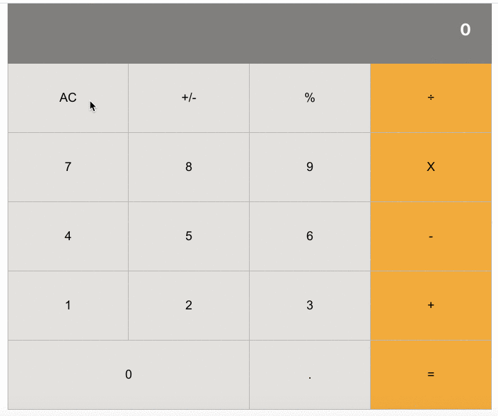

# React Calculator

[live demo](https://srodrig-react-calculator.herokuapp.com)



This is a calculator app built with [React](https://en.reactjs.org/), its goal is to emulate the behavior
of a conventional calculator, but in the browser.

## Requirements

- [yarn](https://yarnpkg.com/) 1.22.4 (or so)
- [node](https://nodejs.org/en/) 14.1.0 (or so)

## Setup

```bash
git clone https://github.com/santiago-rodrig/react-calculator &&
cd react-calculator &&
yarn install
```

To start a local web server with the result type `yarn start` from your terminal.

## License

This is a MIT licensed project, you can read it [here](./LICENSE).

## Authors

This project is authored by [santiago-rodrig](https://github.com/santiago-rodrig)

## Contact

You can reach me out in the following URLs.

- [My website](https://santiagorodriguez.dev)
- [Github](https://github.com/santiago-rodrig)
- [LinkedIn](https://www.linkedin.com/in/santiago-andres-rodriguez-marquez/)
- [AngelList](https://angel.co/u/santiago-andres-rodriguez-marquez)
- [santo1996.29@gmail.com](mailto:santo1996.29@gmail.com)
